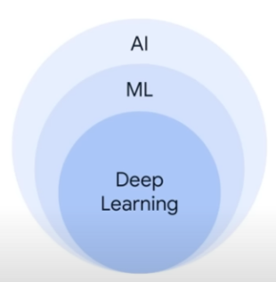

# 🥶 Generative AI: Where Does It Sit?

_Key words: AI, ML, Deep Learning_

Source: Google (Feburary, 2024)

## 🤖 Defining AI: Precisely defining "intelligence" proves elusive. Some propose:

- Google's Definition: AI allows machines to perform tasks typically needing human intelligence. But how do we measure this "intelligence"?
- Behavior-Based Definition: Aiming to create machines behaving intelligently, but lacking precision.
  Task-Based Definition: Making computers do what humans currently excel at.
- Cognitive Ability Definition: Machines performing tasks associated with human cognition.

Key Takeaway: The lack of a clear definition for "intelligence" makes defining AI inherently challenging.

## 🧻 Machine Learning (ML): A subfield of AI.

## 🦌 Deep Learning

## 🦫 Additional References

1. W. Ertel, "Grundkurs Künstliche Intelligenz: eine praxisorientierte Einführung", Springer Vieweg, Wiesbaden, 2021
2. Ralf T., Kreutzer, "Künstliche Intelligenz verstehen: Grundlagen – Use-Cases – unternehmenseigene KI-Journey", Springer Fachmedien Wiesbaden, Wiesbaden, 2019

Optimized with [GEMINI](https://gemini.google.com/app)
