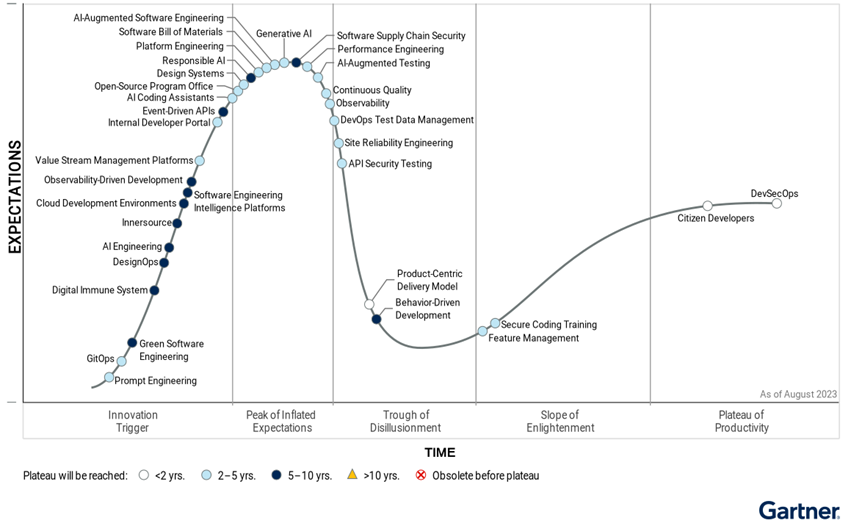

# 🏆 Generative AI: Motivation

Generative AI can create text, images, code, and more. It's useful for generating content, translation, product visuals, and software development. For example, I created this image on my local computer using the [wuerstchen](https://github.com/dome272/Wuerstchen) model:

## 🔑 Possible Use Cases:

There are many possible use cases for generative AI but it is important to understand that Generative AI is not in all use cases the best solutions.

- Content creation: SEO, customer service, education
- Visuals: Synthetic product images, advertising
- Code: Development, review, documentation

Examples:

- Healthcare: Personalized medicine, medical image interpretation
- Finance: AI-managed portfolios, content analysis
- Manufacturing: Product design optimization, diagnostics

The Paper [Harnessing the Power of LLMs in Practice: A Survey on ChatGPT and Beyond](http://arxiv.org/abs/2304.13712) discuss how to select the right model. E.g. for prediction tasks were much labeled data is available a supervised machine learning algorithmen will possibly perform better then the Generative AI. Also the Generative AI model will always have a different output, even the prompt is the same.

The next section is about the Hype Cycle from the Company "Garnter". The Hype Cycle gives an overview in which state we are with the listed technologies.

## 😵‍💫 Hype Cycle:

In the image is the Generative AI located in the "Peak of Inflated Expectations" because that people and companies think that it is the soltution to everything: "Just use ChatGPT for this task". On the other hand, Gartner predicts 50% of software engineers will use ML-powered coding tools by 2027. So there will be an ongoing usage of AI tools. For Example the tool like AISE promise to automate software development.

Source: Garnter.com (Febraury 2024)

## References:

Gartner Hype Cycle: https://www.gartner.com/en/articles/what-s-new-in-artificial-intelligence-from-the-2023-gartner-hype-cycle
Gartner Press Release: https://www.gartner.com/en/articles/what-is-platform-engineering
