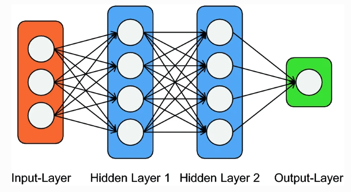

# 🧠 Neuronal Network

## 🐋 What is a neuronal network?

The term neuronal network is from the neuro-science. Neuronal networks are the connection between the neurons which is a part of the central nervous system. The computer science tried to imitate this systems from the central nervous system. The neuronal network can work parallel which makes it possible to learn complex not linear dependencies from the orgin information. These complex learning is independent and is based on the previous knowledge. (1) A neuronal network is a system out of hard- and software similar to the human brain. (1) A neuronal network in computer science does have a huge amout of parallel working processors which are lokated in these three layers:

- Input-Layer
- Hidden-Layer
- Output-Layer

The hidden Layer can be 100, 1000 or more Layers. The system learns (hopefully) from one to the next layer. The neuronal network can look like this:

(Source: Ralf T., Kreutzer, (2019))

The nodes are connected with each other this means that all inputs of one node of the layer n is connected with many of the nodes of the previous layer n-1. It is possible that the input layer does only have one node. All outputs of the layer n are connected with many of the next layer n+1. The connection represent the passing of information to the next layer and node. The output layer can have one or more nodes (1)

Besides that the depth of an neuronal network is defined as the amount of hidden layers. The width of the network is defined as the amount of nodes of the hidden layers or the amount of input and output connections per node. There are different variations possible that allow forward and backward passing of information between the layers. (1)

Each node is assosiated as an own knowledge base. It represents rules that are programmed but also rules which were learned on the training process.

## 🦫 Additional References

1. Ralf T., Kreutzer, (2019) "Künstliche Intelligenz verstehen: Grundlagen – Use-Cases – unternehmenseigene KI-Journey", Springer Fachmedien Wiesbaden, Wiesbaden
