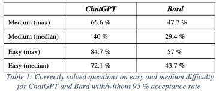

# 📚 Literature

_Key Concepts: ChatGPT, BARD_

## ❓ Questions

- What Literature did I find and on what topics do they focus (Generative AI)?

## 🐳 What Literature did I find and on what topics do they focus (Generative AI)?

First thing I noticed was that there are not "Literature" available on this topic because it is realy new (September 2023). In 2024 I discovered more and more Papers about Generative AI.

Papers with direct links to them:

1. P1, [ChatGPT vs. Bard - Which is better at solving coding problems](https://rgdoi.net/10.13140/RG.2.2.36200.65284)
2. P2, [ChatGPT vs. Bard - A Compparative Study](10.22541/au.168923529.98827844/v1)
3. P3, [Generative AI](https://doi.org/10.1007/s12599-023-00834-7)
4. P4, [Generative AI](https://link.springer.com/10.1007/s12599-023-00834-7)
5. P5, [Harnessing the Power of LLMs in Practice: A Survey on ChatGPT and Beyond](http://arxiv.org/abs/2304.13712)
6. P6, [Is ChatGPT the Ultimate Programming Assistant -- How far is it?](https://arxiv.org/abs/2304.11938)
7. P7, [Just Tell Me: Prompt Engineering in Business Process Management](https://arxiv.org/abs/2304.07183)
8. P8, [Role of ChatGPT in Computer Programming](https://mesopotamian.press/journals/index.php/cs/article/view/51)
9. P9, [What Do We Mean by GenAI? A Systematic Mapping of The Evolution, Trends, and Techniques Involved in Generative AI](https://www.ijimai.org/journal/sites/default/files/2023-11/ijimai8_4_1.pdf)

Many more can be found on [Google Scholar](https://scholar.google.com)

## 🩳 Short Paper Review

The paper reviews are realy short with three steps:

1. Introduction: Simple introduction to the reasearch question, topic or statement.
2. Insights: Showing some information from the paper.
3. Result: One sentence, not much information just the key essence of the paper.

### 1️⃣ P1, ChatGPT vs. Bard - Which is better at solving coding problems

1. Introduction: This paper focusing on the coding tasks solving of the two: ChatGPT and BARD (now Gemini, Feb 2024). It addresses Leet Code Problems and tested how the models solved the problems.

2. Insights: The reasearch did and binary approach of testing the models. A answer was accepted when it passed 95 % of the tests. The paper claims that ChatGPT was in all cases better than BARD. Table 1 does show the results.

3. Result: ChatGPT did better than BARD in all Leet Code Problems.

### 2️⃣ P2, ChatGPT vs. Bard - A Compparative Study

1. Introduction: This paper explains ChatGPT and BARD. It also includes the state-of-the-art transformer architecture. Besides that it explains strentgh and weaknesses of ChatGPT and BARD and the logic how both work.

2. Insights:

- The GPT Model from OpenAI uses the transformer architecture and did "go through training using substantial amounts of textual data and subsequently fine-tuning" (P2). Besides that the new GPT 3.5 Model which is used in the free version of ChatGPT used also learning techniques ike reinforcment learning from human feedback (RLHF)(1) and proximal policy optimization (PPO)(2). The Model consists of two parts: encoder, which processes input text, and the decoder, which generates ouput text. (P2). It predicts the next word based on the context (P2).
- The BARD Model is based on the LaMDA Model but there are not the same (P2). The BARD model focuses on Natural Language Processing (NLP) tasks while "LaMDA is tailored for generativ text in respinse to questions, conversation starters, and prompts (3).
- Another interesting aspect of the Models GPT and BARD is that they both do have atificial hallucinations where the model generates arguably realistic expereincen that do not line up with the real world input (4). 45 % of the responses from ChatGPT contain inaccuracies (5), and approximately 30 % of the reaseach proposals generated by ChatGPT include hallcuinated content (6).
- The paper introduces different use cases e.g. Interactive Professional Exam Performance Analysis, Cyper Security, Education, and Algorithmic Problem Solving.

3. Result: ChatGPT and BARD do have different strengths and limitations. In the right use case one or the other should perform better.

---

## 🦫 Bibliographie

1. B. Liu, Q. Cai, Z. Yang, and Z. Wang, “Neural proximal/trust region policy optimization attains globally optimal policy,” arXiv preprint arXiv:1906.10306, 2019
2. B. Liu, Q. Cai, Z. Yang, and Z. Wang, “Neural proximal/trust region policy optimization attains globally optimal policy,” arXiv preprint arXiv:1906.10306, 2019
3. R. Thoppilan, D. De Freitas, J. Hall, N. Shazeer, A. Kulshreshtha, H.T. Cheng, A. Jin, T. Bos, L. Baker, Y. Du, et al., “Lamda: Language models for dialog applications,” arXiv preprint arXiv:2201.08239, 2022.
4. H. Alkaissi and S. McFarlane, “Artificial hallucinations in chatgpt: Implications in scientific writing,” Cureus, 2023.
5. T. G. Heck, “What artificial intelligence knows about 70 kda heat shock proteins, and how we will face this chatgpt era,” Cell Stress and Chaperones, vol. 28, no. 3, pp. 225–229, 2023.
6. S. A. Athaluri, S. V. Manthena, V. K. M. Kesapragada, V. Yarlagadda, T. Dave, and R. T. S. Duddumpudi, “Exploring the boundaries of reality: Investigating the phenomenon of artificial intelligence hallucination in scientific writing through chatgpt references,” Cureus, vol. 15, no. 4, 2023.
