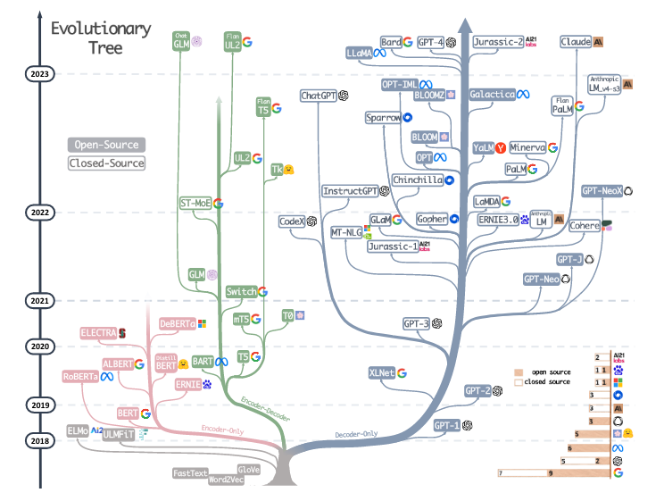

# 🎒 Large Language Models

## What are LLMs?

Large Language Models (LLMs) are huge language models pretrained on large amounts of datasets withput tuning on data for specific tasks. (1)(2) LLMs combine three characteristics. First a large-scale, sequential neural network network (e.g. [transformer](../transformer/README.md) with attention mechanism). Second, the "neural network is pretrained through self-supervision in which auxiliary rass are desined to learn a representation of naturla language without risk of overfitting (e.g. next-word prediction)." (2) Third, the pretaining includes large-scale data sets like Wikipedia, or even multi-language datasets.

## What are the state of the art language models out there?

LLMs differ in their traing strategies, model architectures, and uses cases. For a better understanding, LLMs can be categorized into two types: encoder-decoder or encoder-only language models and decoder-only language models. (1)

Evolutionary Tree LLMs (Source: 1, Page 3)

**Encoder-Decoder or Encoder-only** (BERT-style)

- Training: Masked Language Models
- Model type: Discriminative
- Pretrain task: Predict masked words

LLMs: ELMo, BERT, RoBERTa, DistilBERT, BioBERT (1)

**Decoder-only** (GPT-sytle)

- Training Autoregressive Language Models
- Model type: Generative
- Pretrain task: Predict next word

LLMs: GPT-3, OPT, PaLM, BLOOM, MT-NLG (1)

## Further acknowledgement by J. Yang et. al (1)

The reference states some knowledge they possed while studying the llm field:

1. Decoder-only models have been dominating the development of LLMs since 2021 after the release of GPT-3
2. OpenAI consistently maintains its leadership position in LLM, both currently and potentially in future
3. Meta contributes significantly to open-source LLMs and promotes research of LLMs
4. LLMs exhibit a tendency towards closed-sourcing. Before 2020 the majority LLMs were open-sourced. Currently, companies close-sources their models.
5. Encoder-decoder models remain promising.

## 🦫 References

1. J., Yang et al., “Harnessing the Power of LLMs in Practice: A Survey on ChatGPT and Beyond”, arXiv ID: arXiv:2304.13712, 2023
2. S., Feuerriegel et al., "Generative AI", 2024
