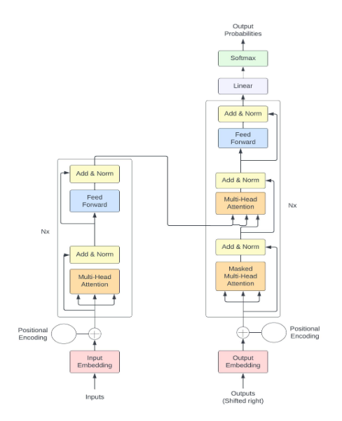

# 🎵 Transformer Architecture

## What is the Transformer Architecture?

The Transformer Architecture is a deep learning architecture (Vaswani et al. 2017) that adopts the mechanism of self attention which is the core of the transformer architecture. This mechanism allows the model to weight or focus on the importance of each part of the input data. (1)(2) The machanism "assigns varying degress of importance to different elements of the input" (2) which enables - compared to other models - processing of long and complex input sequences. (1)

This makes the transformer architecture realy useful in tasks such as language generation and understanding, where the context plays a curical role. (2) The transformer is designed for the same tasks as recurrent neural networks (RNNs) and process squential data, such as natural language (NP) designed for tasks like translation and tasks summarization. (1)

The difference between RNNs and the Transformer is that the Transformer process the entire input all at once. This means, that the "attention mechanism provides context for any position in the input sequence." (1)

The output of a transformer is eventually a document embeding, which represents a lower-dimensional representation of the text (or other input) sequences where similar text are located in closer proximity which typically benefits downstream tasks as this allows to capture semantics and meaning (Siebers et a. 2022)

Transformer Architecture (Source: (2))

In summary, the transformer architecture enables understanding of large complex language pattern effectively due to the attention mechanism that can process all input data at once. The use of a large-scale input data enables with the attention mechanism a higher degree of coherence, contextual relevance, can capture nuances of language, and provide accurate predictions based on the input data. This architecture enables new possibilities for the process of development of intelligent conversational AI systems. (2)

---

## 🦫 References

1. S., Feuerriegel et al., "Generative AI", 2024
2. I., Ahmed et al., "ChatGPT vs. Bard: A Comparative Study", 2023
